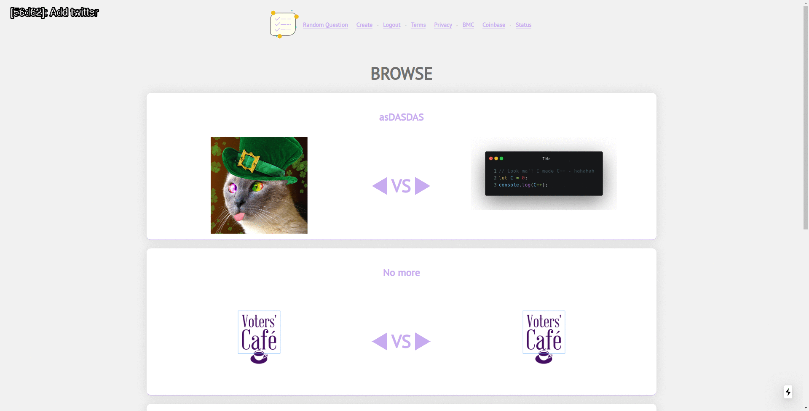

# Versions

## A tool to generate a simple version-lapse (timelapse) for a front-end in a repo (git repository)

## Sample

[versions-test](https://github.com/Mobilpadde/versions-test)

## Why

I always think it's fun to look at the progess of any project that I - or others - make. Sadly, it's a bore to check out every version committed on git and starting a server. Thus, this tool has come to life! 🤓

## What

Explained in simple words: It makes a version-lapse of a repo.

Please checkout the gif below to see my example of this.

An **older** version of Versions was used to generate the below

## How

It's quite simple to use. I promise! Download the source-code of this repo. Fire up a terminal and type in `go run . -repo ../path/to/git/repo -commits 5 -wait 5 -port 5000`, this will make a version-lapse of of the last `5 commits` of the repo `../path/to/git/repo`. It starts a dev-server for each commit - on port `5000`, waits `5 seconds`, takes a screendump, closes the dev-server and annotates the image. Lastly it makes the `5 commits` into a gif. Easy peasy!

## Usage

First, make sure you have `ImageMagick <= 7.x` installed.

Second, have a `google-chrome-beta`-browser installed. (or cahnge the source code to specify another version of a chromium-based browser [here](shoot/config.go#L19))

Third, and most importantly, have `go >= 1.11` installed - As I'm not yet providing native builds of this program.

And, of course, `git` and a local repo.

Then we have some flags to configure.

Required:

-   `-repo` - specifies the path to the repo you'd like to make a verison-lapse of.

Useful:

-   `-dump`

    -   defaults to `./screendumps`, is the directory to dump the screenshots in.

-   `-out`

    -   defaults to `./out`, is the path to place the generated gif(s).

-   `-manager`

    -   defaults to `pnpm` is the package-manager to run.
        -   usually I've had the most success with `yarn`.

-   `-cmd`

    -   defaults to `dev`, is the name of the `package.json`-script to run a `dev-server`.

-   `-install`

    -   is the install command of the package-manager
        -   `yarn` uses nothing, thus it'll be `-install ""`
        -   `(p)npm` uses `i` or `install` thus making it `-install "i"`

-   `-paths`

    -   is the paths to run after the server has spun up
        -   defaults to `/`, can be multiple if seperated by comma. (eg. `/,/page2,/page3`)

-   `-port`

    -   defaults to `5000`, used to specify the port of the server.

-   `-wait`

    -   defaults to `5`, this is the wait time before and after spun-up server

-   `-commits`

    -   defaults to `0`, meaning all the commits.
        -   I'd suggest something like 4 for testing.

Debugging:

-   `-v`

    -   defaults to `false`, logs the manager-commands - useful for figuring out how much the `-wait` should be.

-   `-vvv`
    -   defaults to `false`, log most things.

## Post Scriptum

~~Only works with `pnpm` at the moment.~~

If the program crashes at any point, you'd `git checkout master` on the repo specified. The program **will** try to clean up after itself, but might fail at times.

If you by any reason decide to run the program again on the same repo or any other repo, it'll clean the `screendumps/`-dir and `out/`-dir. So, make sure to save whatever you need!

_Thanks!_ - Mads Cordes ([@Mobilpadde](https://twitter.com/Mobilpadde "Twitter")).
